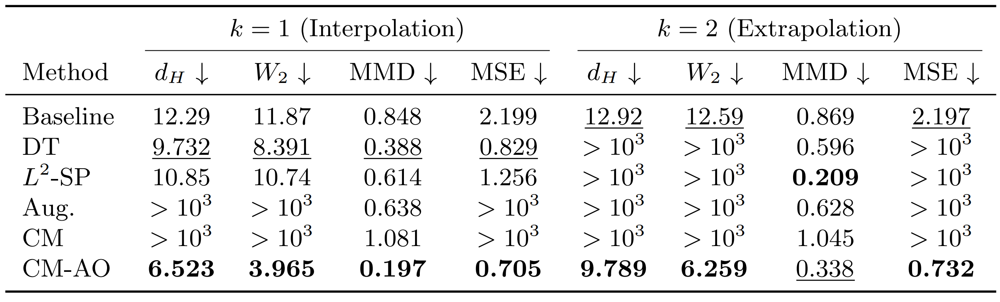
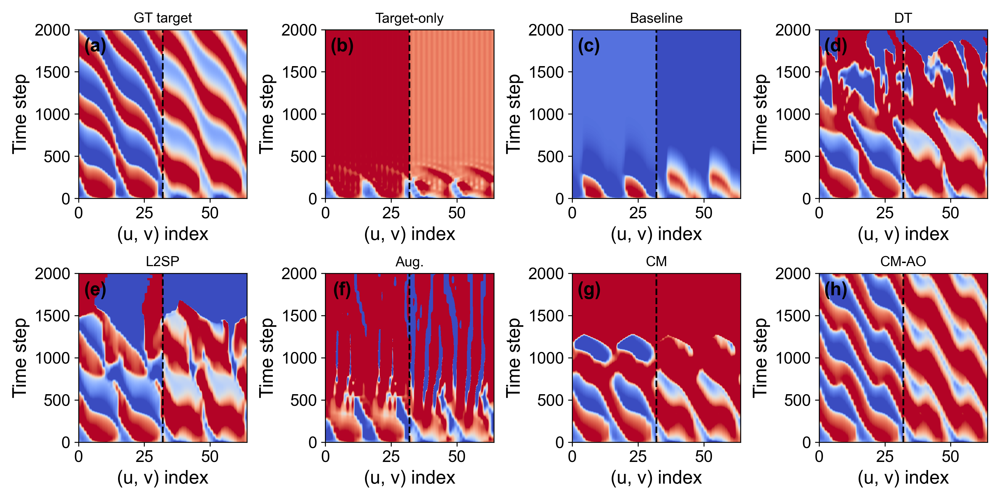
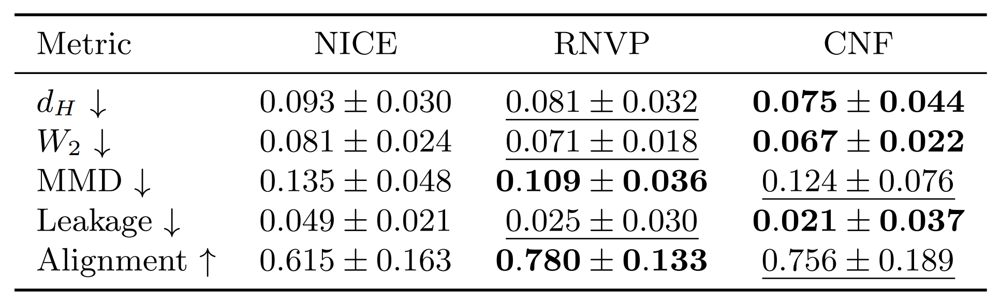
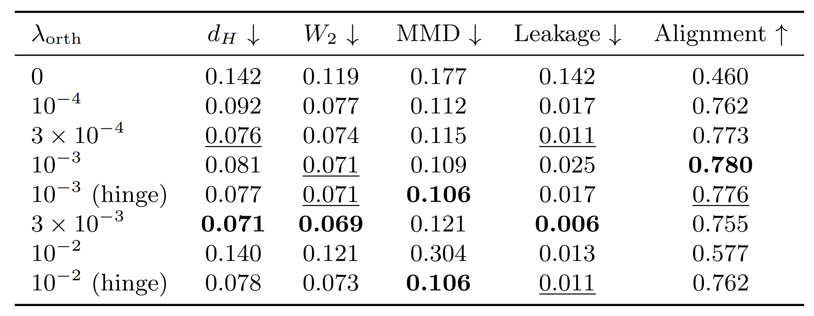
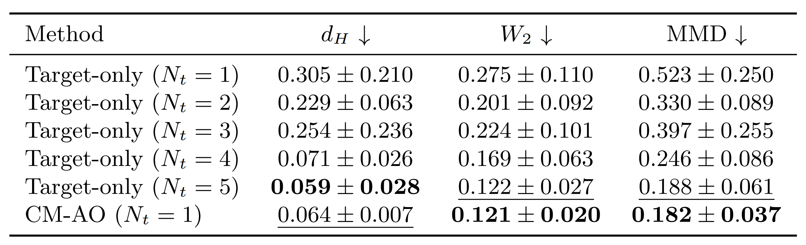
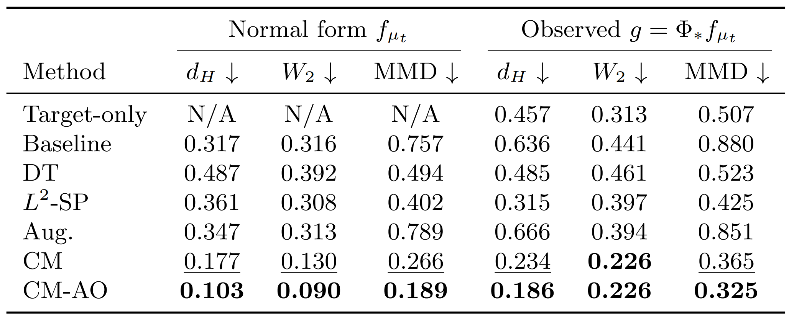
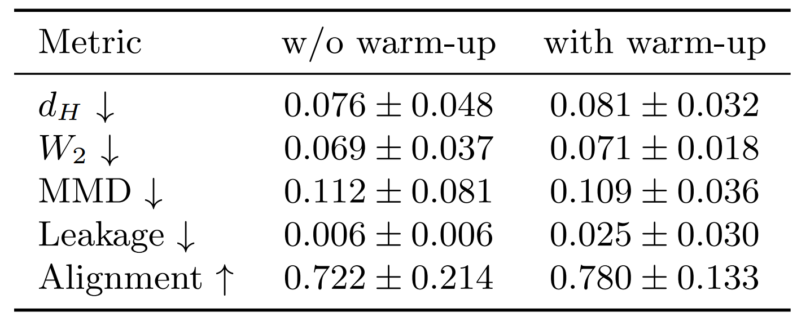
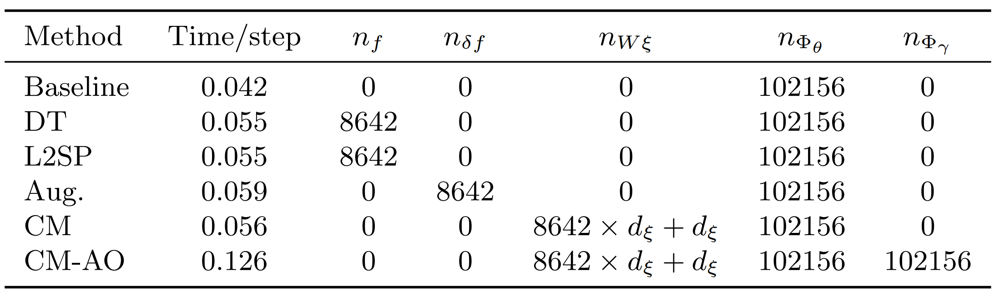
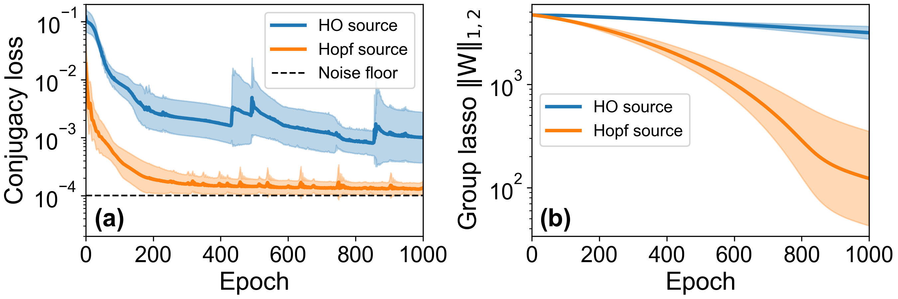

# Identifiable Smooth Conjugacy Learning
## Table 1 and Figure 1. 64D Reaction-Diffusion Benchmark

**Table 1. Invariant-set metrics for the 64-dimensional FitzHugh-Nagumo reaction-diffusion benchmark with periodic boundary conditions,** governed by $\partial_t u = 0.15\partial_x^2 u + u - u^3/3 - v + \mu, \partial_t v = 0.08(u + 0.7 - 0.9v)$. The source NODE model was trained on trajectories from the $\mu=0$ regime, using initial conditions $(u(0), v(0)) \sim U([-1,1]^{2D=64})$ with $D=32$, $N_s=64$, $dt=0.05$, and $T=1000$. Each method was then transferred to the $\mu=0.6$ regime using a single target trajectory generated from the controlled initial condition $(u_j(0),v_j(0)) =(A\cos(\phi_j)+\varepsilon^{(u)}_j,B\sin(\phi_j)+\varepsilon^{(v)}_j)$, with $\phi_j = \phi_0 + k(2\pi j)/D$, $\phi_0 \sim U([0,2\pi])$, and $\varepsilon^{(u)}_j,\varepsilon^{(v)}_j \sim \mathcal{N}(0,0.05^2)$, where $A=1.0$, $B=0.8$, and $k=1$ (winding number 1), for $j=0, \cdots, D-1=31$. The target trajectory was generated with $dt=0.05$, $T=500$, and additive noise $\sigma=0.01$. We report invariant-set metrics in two settings: $k=1$ (winding number 1; phase-space interpolation), and $k=2$ (winding number 2; phase-space extrapolation).

**Figure 1. Qualitative comparison of spatiotemporal rollouts ($k = 2$) on the FitzHugh-Nagumo reaction-diffusion benchmark.** Heatmaps are shown in the 64-dimensional $(u,v)$ state, with the horizontal axis representing the concatenated state index and the vertical axis representing time steps; the dashed line separates the $u$ and $v$ components.
***
## Table 2. Adversarial Orbit-Tangent Architecture Ablation

**Table 2. Comparison of normal-form identification metrics across different adversarial orbit-tangent architectures for the Hopf experiment:** NICE, a simple volume-preserving additive coupling model; RNVP, a non-volume-preserving affine coupling model; and CNF, a flexible neural vector field model. Here, “leakage” measures the cosine similarity between the ground-truth orbit-tangent direction $r_\mathrm{gt}$ and the modeled correction $\Delta f_\mathrm{pred}$, whereas “alignment” measures the cosine similarity between the ground-truth correction $\Delta f_\mathrm{gt}$ and $\Delta f_\mathrm{pred}$.
***
## Table 3. Orthogonality Regularization Strength Ablation

**Table 3. Comparison of normal-form identification metrics across different $\lambda_\mathrm{orth}$.** Note that $\lambda_\mathrm{orth} = 0$ corresponds to the CM baseline without the orthogonal regularization. “Hinge” denotes a simple hinge-loss variant of the orthogonality loss applied in the main step, while keeping the adversarial step unchanged. Here, “leakage” measures the cosine similarity between the ground-truth orbit-tangent direction $r_\mathrm{gt}$ and the modeled correction $\Delta f_\mathrm{pred}$, whereas “alignment” measures the cosine similarity between the ground-truth correction $\Delta f_\mathrm{gt}$ and $\Delta f_\mathrm{pred}$.
***
## Table 4. Target-Only Comparison

**Table 4. Comparison of the observation-space invariant-set metric between the proposed CM-AO and a purely target-only NODE baseline on the Hopf benchmark.** Here, $N_t$ denotes the number of target trajectories used for training the target-only model, whereas for CM-AO it is fixed at 1. Since the target-only model does not involve any explicit notion of source dynamics or normal-form identification, we report only the invariant-set metrics evaluated in the target observation space.
***
## Table 5. Off-Limit-Cycle Initial-Condition Extrapolation

**Table 5. Invariant-set metrics for the Hopf problem under the off-limit-cycle initialization setting:** the training target trajectories are sampled only from initial conditions far from the limit cycle ($r \sim U([1,1.2])$, compared with the limit-cycle radius $\sqrt{\mu} \approx 0.32$) and with a short horizon ($T=20$), so that the training data do not reveal the limit-cycle geometry. Eight target trajectories are used for this experiment.
***
## Table 6. Warm-Up Ablation

**Table 6. Comparison of normal-form identification performance metrics with and without warm-up for the Hopf experiment.** Here, “leakage” measures the cosine similarity between the ground-truth orbit-tangent direction $r_\mathrm{gt}$ and the modeled correction $\Delta f_\mathrm{pred}$, whereas “alignment” measures the cosine similarity between the ground-truth correction $\Delta f_\mathrm{gt}$ and $\Delta f_\mathrm{pred}$.
***
## Table 7. Computational Cost and Parameter Count

**Table 7. Wall-clock time per training step and number of trainable parameters for each method.** Here, $n_f$ and $n_{\Phi}$ are the parameter counts of the source NODE and conjugacy map, respectively; $n_{\delta f}$ and $n_{W\xi}$ are those of the augmentation and context modulation modules; $n_{\mathrm{\Phi_\gamma}}$ is that of the adversarial generators. Only trainable parameters are included in the count.
***
## Figure 2. Mismatched Source Detection

**Figure 2. Comparison of the learning dynamics of (a) the conjugacy loss and (b) the group-lasso norm of the basis weights $W$ for the harmonic-oscillator (HO) source and the Hopf source.** The noise floor is defined as the mean squared difference between the clean ground-truth target trajectories and the noisy trajectories used during training. When the structurally mismatched HO source is used, the conjugacy loss and, especially, the basis-weight norm no longer decrease during training but instead plateau across epochs. This serves as a practical diagnostic that the selected source is not an appropriate structural anchor for the target dynamics.
***

